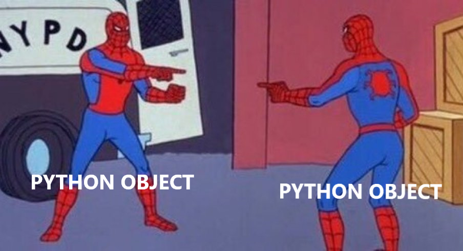

# Python - Everything is object



An object in Python is like a container that holds data and knows how it behaves. It's been interesting to see how Python works, and how it handles objects in memory. I now have an understanding of how everything in Python is an object. Rather than variables storing values, it actually points to the object in memory as a reference. Every list, string, number, and even functions themselves live in memory as objects that code interacts with. Understanding this idea has helped me see how variables, references, and object behaviour actually work behind the scenes.

## `type()`
There are mutliple different types of objects. To view the type, wrap the variable inside `type()`.

### Example 1 - Numbers:
```python
x = 10
print(type(x))
```
Output:
```bash
<class 'int'>
```
This tells you the object is an integer.
<br><br>

### Example 2 - String:
```python
name = "Carla"
print(type(name))
```
Output:
```
<class 'str'>
```
This tells you the object is a string.
<br><br>

### Example 3 - List:
```python
nums = [1, 2, 3]
print(type(nums))
```
Output:
```bash
<class 'list'>
```
This tells you the object is a list.
<br><br>

### Example 4 - Dictionary:
```python
person = {"name": "Carla"}
print(type(person))
```
Output:
```bash
<class 'dict'>
```


## `id()`
In Python, every object in Python has a unique identifier, which in CPython, is the object's memory address. To display this, you can wrap your variable inside `id()`.

For example:
```python
x = 10
print(id(x))
```
This will print the variable id:
```bash
140726794751328
```

### Assignment
Assignment is when you give a name to an object using `=`.

Example:
```python
a = [1, 2, 3]
```
Here, Python creates a list object `[1, 2, 3]` and the name `a` is assigned to that object.
```
a ─────────▶ [1, 2, 3]
```

### Referencing
Referencing is the link between the name and the object in memory.

Example:
```python
b = a
```
Here, you’re creating a new reference, not a new list. `b` now points to the same object that `a` already points to.
```css
a ─────────▶ [1, 2, 3] ◀──────── b
```
<br><br>

So, if two variables point to the same object (referencing), their id's will be the same as both variables are pointing to the same memory address.

For example:
```python
a = [1, 2, 3]
b = a

print(id(a))    # example: 140805127282688
print(id(b))    # same number
```
<br><br>

Most of the time, if the variables are not linked, the objects are different, which means their id's will also be different.  
_Note: this is not always the case for some immutable objects_

Example:
```python
nums = [1, 2, 3]
other = [1, 2, 3]

print(id(nums))
print(id(other))
```
Each statement will print two different variable id's, as each variable is a unique list.
<br><br>


## Immutable Objects
An immutable object is a type of object you cannot change once it's created. If you try and change it, Python creates a new object.

**Immutable Types:**
- number (int, float, complex)
- string
- tuple
- frozen set
- bool
- byte
<br><br>

Example:
```python
name = "carla"
name = name.upper()
```
Here, it looks like `"carla"` is changed to `"CARLA"`. However, what Python actually did was create a new string `"CARLA"`, and `name` now points to this new object.
<br><br>

**How immutable objects are stored:**  
Immutable objects are kept in memory as fixed-value objects. When you “change” them, Python doesn’t update the existing memory — it creates a brand new object somewhere else in memory and moves your variable name to point to the new object. The old one stays as it is.
<br><br>

However, for some immutable objects, like small strings and small integers, immutable objects and its address can sometimes be reused.

Example:
```python
a = "carla"
b = "carla"
```
Python may reuse the same `"carla"` object for both, so their variable id will be the same.


## Mutable Objects
A mutable object is a type of object you can change after its created. You can modify it in place, without creating a new object.

**Mutable Types:**
- list
- dictionary
- set
- byte array
<br><br>

Example:
```python
nums = [1, 2, 3]
nums.append(4)
```

The same list in memory was changed. `nums` will be appended and the output will then be:
```bash
[1, 2, 3, 4]
```

## Aliases
Aliases happen when two or more variable names point to the same object in memory.

Example:
```python
x = [1, 2, 3]
y = x
```
Here, y is an alias of x. Both names refer to the same list. If one changes the list, both variables see the change.

## Passing Variables to Functions
Python handles function arguments using `pass-by-assignment`.

This means:
- The function receives the reference to the object, not the value.
- If the object is mutable, the function can change it.
- If the object is immutable, the function cannot change the actual object, only reassign the variable name inside the function.

Example with mutable:
```python
def add_one(lst):
    lst.append(1)

nums = [1, 2]
add_one(nums)
print(nums)
```
Outcome:
```bash
[1, 2, 1]
```
<br><br>

Example with immutable:
```python
def change(x):
    x = 10

a = 5
change(a)
print(a)
```
Outcome
```bash
5
```

## Special Case: Tuples and Frozen Sets
Even though tuples and frozensets are immutable, they can contain mutable objects.

Example:
```python
t = ([1, 2], 3)
```
The tuple itself cannot be changed, but the list inside it can be changed:
```python
t[0].append(4)
print(t)
```
Outcome:
```bash
([1, 2, 4], 3)
```

## Integer Pre-allocation in CPython
CPython automatically creates the integers from -5 to 256 when the interpreter starts. These are reused every time they appear in your code.

This is controlled by two internal values:
- `NSMALLPOSINTS` -> number of pre-created small positive integers
- `NSMALLNEGINTS` -> number of pre-created small negative integers

Python does this because small integers like `0`, `1`, `2`, `3` are used constantly, so reusing them makes programs faster and saves memory.

Example:
```python
a = 10
b = 10
print(id(a), id(b))
```
a and b are both have the same memory address.

Why -5 to 256? These are considered the “most commonly used” integers across most Python programs, so CPython optimises them.
